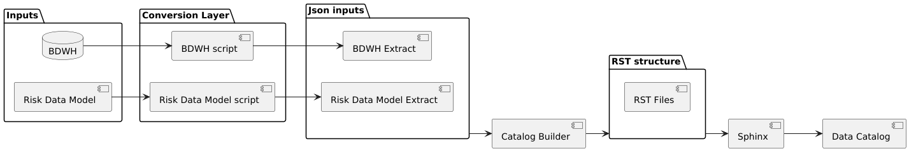

Data Catalog Generation API Readme
========================

.. contents:: :local:

General Information
-------------------
- Data catalog page: https://yudai-yam.github.io/data_catalog/
- Source Code: https://github.com/yudai-yam/data_catalog

Short Description / Background
------------------------------
This repository generates HTML pages as a data catalog from the json files provided in `inputs directory`_.
It also provides a functionality to extract tables from DB.
The `inputs directory`_ should contain json files that follows the format described in `JSON Template`_

The whole pipeline is shown in the image below.

The first three steps, namely Inputs, Conversion Layer, and json inputs are to be taken care of outside
this data catalog program.

Project Structure
-----------------

::

    ers.data_catalog
    ├── src
    │   ├──db_extract
    │   │    ├── utils
    │   │    ├── .env
    │   │    ├── config.py
    │   │    └── main.py
    │   │
    │   └── data_catalog
    │        ├── catalog_builder
    │        │    ├── main.py
    │        │    ├── config.py
    │        │    ├── utils.py
    │        │    └── write_rst.py
    │        ├── main.py
    │        └── templates
    └── inputs

db_extract
^^^^^^^^^^^^
Contains scripts for extracting data from database as a JSON file.

data_catalog
^^^^^^^^^^^^
Contains scripts for building data catalog html page from the json files provided in the `inputs directory`_.

catalog_builder
^^^^^^^^^^^^^^^
Contains scripts for generating RST files based on the templates in the `templates`_ directory.

templates
^^^^^^^^^
Contains RST templates for `catalog_builder`_.

Inputs Directory
----------------
This is where JSON files extracted from DB are stored.
This data catalog creates HTML pages based on those JSON files.
The location must be ``exg.app.ers.data_catalog/inputs``.
The naming of the file must follow the convention of ``<name of db>.json``.

Installation
------------
Install the project dependencies using pip.

.. code-block::

    pip install -e .[dev]

To perform an extraction from DB, make sure to install extract dependency as well.

.. code-block::

    pip install -e .[dev,extract]

Execute the job
------------
Build RST files and generate HTML files under docs based on the json files in the `inputs directory`_.

.. code-block::

    dev

Data Extraction from DB
------------
Extract data from BDWH DB as a JSON file.

.. code-block::

    extract_bdwh

Build RST files using the extracted data
------------
Build RST files based on the extracted data stored in the `inputs directory`_.

.. code-block::

    build

HTML Generation
------------
Generate HTML files from the RST files.

.. code-block::

    sphinx-build -E -d .doctree -c . rst_source docs

JSON Template
-------------
A key for each entry is a table name. Note that the file name
(ex. ``DB.json``) is recognized as the name of DB, and displayed in the page.
These files must be stored in the `inputs directory`_.

.. list-table:: *Table Key-Value Pair*
   :widths: 25 50
   :header-rows: 1

   * - Key
     - Description
   * - ``TABLE_NAME``
     - name of the table
   * - ``author``
     - name of the author of the table
   * - ``description``
     - description of the table
   * - ``comments``
     - (Optional) comments on the column, stored in a list
   * - ``regression_test_config``
     - directory containing regression testing configurations:
   * - ``comparison_key``
     - a list of keys used for comparison during regression testing
   * - ``columns_to_ignore``
     - (Optional) a list of columns to ignore during regression testing
   * - ``where_query``
     - (Optional) where clause used during regression testing

.. list-table:: *Column Key-Value Pair*
   :widths: 25 50
   :header-rows: 1

   * - Key
     - Description
   * - ``column_name``
     - name of column
   * - ``comments``
     - comments on column
   * - ``data_type``
     - data type of column

*JSON Structure Example*
::

    {
      TABLE_NAME: {
        "author": "Table Author Name",
        "description": "To get the end of day exchange rates",
        "comments": [
          "run as it is",
          "it contains several snapshots a day"
        ]
        "regression_testing_config": {
          "comparison_key: [
            "RPT_DATE",
            "RPT_TIME",
            "POOLID",
            "EXCHANGE_MEMBER",
          ],
          "columns_to_ignore: [
            "SERIAL_NO",
            "ITS"
          ],
          "where_query": "start_handel > sysdate -360 and ende_handel < sysdate + 360"
        }
        "columns": [
          {
            "column_name": "TRANDAT",
            "comments": "transaction date",
            "data_type": "DATE"
          },
          {
            "column_name": "EXCHRAT",
            "comments": "exchange rate",
            "data_type": "NUMBER"
          }
        ]
      },
      TABLE_NAME: {
        "author": "Author Name",
        "description": "Provide relevant contract data for Stresstest application",
        "comments": [
            "contains all values",
            "source currency code is shown"
        ],
        "regression_testing_config": {
          "comparison_key: [
            "TRANDAT",
            "CURRTYPCOD",
          ],
          "columns_to_ignore: [
            "IMPTIM",
            "DUMMY"
          ],
          "where_query": "rpt_date in (select distinct rpt_date from DAL_RISK_O.risk_v_eod_daily_margin_eur order by rpt_date desc fetch first 5 rows only)"
        },
        "columns": [
          {
            "column_name": "CURRTYPCOD",
            "comments": "source currency code",
            "data_type": "VARCHAR2"
          }
          {
            "column_name": "HAIRCUTPCNT",
            "comments": "conversion factor to convert target currency from source currency",
            "data_type": "NUMBER"
          }
        ]
      },
    }
